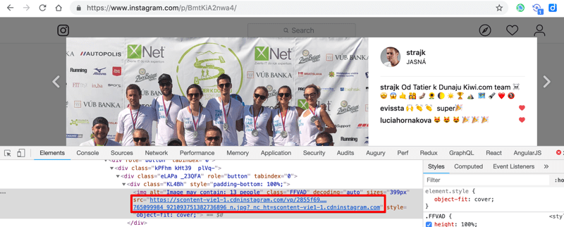
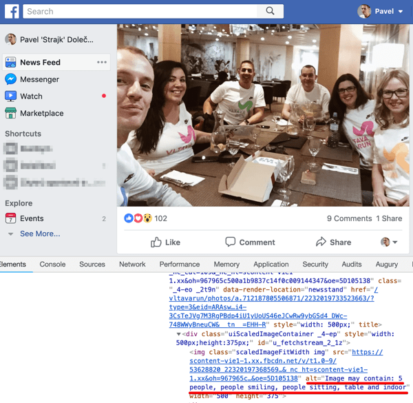
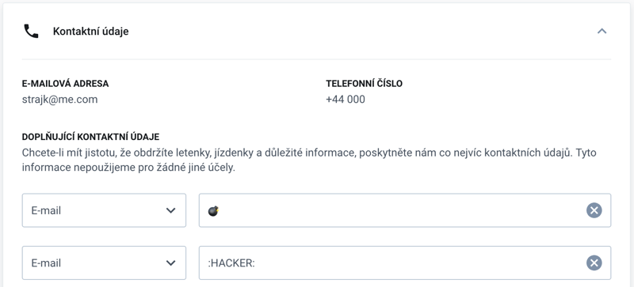

## Prerequisites

* Curious mind
  * https://www.goodreads.com/book/show/35167685-surely-you-re-joking-mr-feynman  

## Workshop

### Motivation

**Edit Instagram followers**

  

**Download "protected" photo from Instagram**


  
**Get around Pinterest Sign-up modal**


**Inspect image titles on Facebook**



**Inspect & adjust Network requests, avoid client side validation**



**XSS Story**

Cannot be published online :troll:


### HTML, CSS

* [htmlreference.io](https://htmlreference.io/)
* [cssreference.io](https://cssreference.io/)

Playground https://codepen.io/Strajk/pen/VRpzMp?editors=1100

Play https://flukeout.github.io/

### DevTools

* Explore Cypress homepage through DevTools
* Explore Kiwi.com homepage, explain complexity
* Explore Google Flights, explain complexity
* Quickly show DevTools in other browsers

#### Resources
* [Get Started With Viewing And Changing The DOM](https://developers.google.com/web/tools/chrome-devtools/dom/#appendix) by Google Developers


### Play

[Stylish](https://chrome.google.com/webstore/detail/stylish-custom-themes-for/fjnbnpbmkenffdnngjfgmeleoegfcffe) -> Kiwi.com rotate logo    
  

## Follow up

Use DevTools to fake something and paste screenshot to our Slack channel.

**Be creative**

---

## CSS for rotating logo

```
[data-test="Logo"] {
    animation: spin 1s linear infinite;
}

@keyframes spin { 100% { -webkit-transform: rotate(360deg); transform:rotate(360deg); } }
``` 
