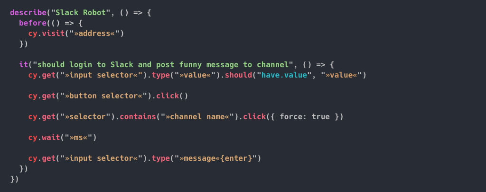

# Automation

## Prerequisites

* **Laziness** -> delegate work to computers

## Motivation

* Fun – you can tell computers what to do and they will do it
	* [Robot beats "I am not a Robot" Captcha](https://www.youtube.com/watch?v=fsF7enQY8uI)
	* [Why Programming Is Important?](https://www.youtube.com/watch?v=Dv7gLpW91DM)
* Necessary (to survive ☠️) – 
  * [Black Mirror Metalhead vs Boston Dynamics](https://www.youtube.com/watch?v=skFlAnvPSNQ)
  * [Black Mirror's Metalhead Is Upon Us](https://www.youtube.com/watch?v=Fvr-uYliHUg)

#### Demo

Use GhostInspector.com to automate something fun!

## Workshop

#### Goal

Using Cypress, login to Slack and write some funny message to our channel.

### Cheatsheet

#### Navigating
* ️[**setCookie**](https://docs.cypress.io/api/commands/setcookie.html)
* [**visit**](https://docs.cypress.io/api/commands/visit.html)
* [go](https://docs.cypress.io/api/commands/go.html)
* [reload](https://docs.cypress.io/api/commands/reload.html)

#### Selecting
* ️[**get**](https://docs.cypress.io/api/commands/get.html) `cy.get('h1.title')` 
* [**️contains**](https://docs.cypress.io/api/commands/contains.html) `cy.contains('Joe')`
* [focused](https://docs.cypress.io/api/commands/focused.html) `cy.focused()` 

#### Asserting/Expecting
* [**should**](https://docs.cypress.io/api/commands/should.html) 

➡️[List of Assertions](https://docs.cypress.io/guides/references/assertions.html#BDD-Assertions)

#### Interaction
* [**click**](https://docs.cypress.io/api/commands/click.html) & [dblclick](https://docs.cypress.io/api/commands/dblclick.html)
* [**type**](https://docs.cypress.io/api/commands/type.html) & [clear](https://docs.cypress.io/api/commands/clear.html)
* [focus](https://docs.cypress.io/api/commands/focus.html) & [blur](https://docs.cypress.io/api/commands/blur.html)
* [check](https://docs.cypress.io/api/commands/check.html) & [uncheck](https://docs.cypress.io/api/commands/uncheck.html)
* [select](https://docs.cypress.io/api/commands/select.html)
* [submit](https://docs.cypress.io/api/commands/submit.html)

#### Viewport
* [viewport](https://docs.cypress.io/api/commands/viewport.html)
* [scrollIntoView](https://docs.cypress.io/api/commands/scrollintoview.html)
* [scrollTo](https://docs.cypress.io/api/commands/scrollto.html)

#### Utils
* [**wait**](https://docs.cypress.io/api/commands/wait.html)
* [screenshot](https://docs.cypress.io/api/commands/screenshot.html)

#### Debugging 🛠
* [**log**](https://docs.cypress.io/api/commands/log.html)
* [debug](https://docs.cypress.io/api/commands/debug.html)  
* [pause](https://docs.cypress.io/api/commands/pause.html)

#### Interaction programmatically 🤖
* [invoke](https://docs.cypress.io/api/commands/invoke.html) - function
* [its](https://docs.cypress.io/api/commands/its.html) - property
* [then](https://docs.cypress.io/api/commands/then.html)
* [trigger](https://docs.cypress.io/api/commands/trigger.html)

* [each](https://docs.cypress.io/api/commands/each.html)

#### Environment 🤖
* [location](https://docs.cypress.io/api/commands/location.html)
* [hash](https://docs.cypress.io/api/commands/hash.html)
* [title](https://docs.cypress.io/api/commands/title.html)
* [url](https://docs.cypress.io/api/commands/url.html)

#### Mocking 🌍
* [fixture](https://docs.cypress.io/api/commands/fixture.html)
* [server](https://docs.cypress.io/api/commands/server.html)
* [spy](https://docs.cypress.io/api/commands/spy.html)
* [stub](https://docs.cypress.io/api/commands/stub.html)
* [request](https://docs.cypress.io/api/commands/request.html)
* [route](https://docs.cypress.io/api/commands/route.html)

#### More selectors 🙈
* [first](https://docs.cypress.io/api/commands/first.html) & [last](https://docs.cypress.io/api/commands/last.html) & [eq](https://docs.cypress.io/api/commands/eq.html)
* [filter](https://docs.cypress.io/api/commands/filter.html)
* [not](https://docs.cypress.io/api/commands/not.html) 
  
* [find](https://docs.cypress.io/api/commands/find.html)

* [closest](https://docs.cypress.io/api/commands/closest.html)
* [parent](https://docs.cypress.io/api/commands/parent.html)
* [parents](https://docs.cypress.io/api/commands/parents.html)
* [parentsUntil](https://docs.cypress.io/api/commands/parentsuntil.html)
* [children](https://docs.cypress.io/api/commands/children.html)
* [siblings](https://docs.cypress.io/api/commands/siblings.html)
* [prev](https://docs.cypress.io/api/commands/prev.html)/[prevAll](https://docs.cypress.io/api/commands/prevall.html)/[prevUntil](https://docs.cypress.io/api/commands/prevuntil.html) & [next](https://docs.cypress.io/api/commands/next.html)/[nextAll](https://docs.cypress.io/api/commands/nextall.html)/[nextUntil](https://docs.cypress.io/api/commands/nextuntil.html)
