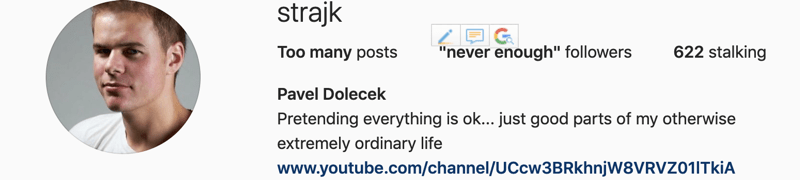

# DevTools ⚙

## Prerequisites

* Curious mind
  * <https://www.goodreads.com/book/show/35167685-surely-you-re-joking-mr-feynman>

## Motivation

#### Edit Instagram followers

  

#### Download "protected" photo from Instagram


  
#### Get around Pinterest Sign-up modal


#### Inspect image titles on Facebook


#### Inspect & adjust Network requests, avoid client side validation


#### XSS Story

Cannot be published online :troll:

## Workshop

### HTML, CSS

* [htmlreference.io](https://htmlreference.io/)
* [cssreference.io](https://cssreference.io/)

Playground <https://codepen.io/Strajk/pen/VRpzMp?editors=1100>

Play <https://flukeout.github.io/>

### DevTools

* Explore Cypress homepage through DevTools
* Explore Kiwi.com homepage, explain complexity
* Explore Google Flights, explain complexity
* Quickly show DevTools in other browsers

#### Resources

* [Get Started With Viewing And Changing The DOM](https://developers.google.com/web/tools/chrome-devtools/dom/#appendix) by Google Developers

### Play

[Stylish](https://chrome.google.com/webstore/detail/stylish-custom-themes-for/fjnbnpbmkenffdnngjfgmeleoegfcffe) -> Kiwi.com rotate logo

## Follow up

Use DevTools to fake something and paste screenshot to our Slack channel. **Be creative**

### Theory

[W3schools CSS Selectors reference](https://www.w3schools.com/cssref/css_selectors.asp)

---

## CSS for rotating logo {docsify-ignore}

```css
[data-test="Logo"] {
    animation: spin 1s linear infinite;
}

@keyframes spin { 100% { -webkit-transform: rotate(360deg); transform:rotate(360deg); } }
```
