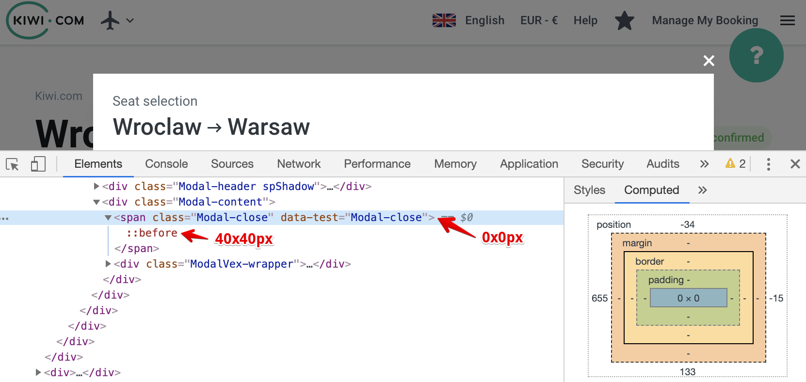
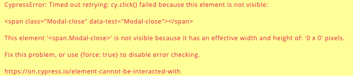

# Dimensionless modal close button

Modal close buttons on Kiwi.com are styled **little bit hacky**.

Modal button element itself is dimensionless (that means, is 0x0 px).
What actually has dimensions (and the cross icon) is it's [pseudo-element `:before`](https://developer.mozilla.org/en-US/docs/Web/CSS/::before)



Cypress [checks element dimensions (among lot of other things)](https://docs.cypress.io/guides/core-concepts/interacting-with-elements.html#Actionability)
to determine if element is actionable (can be clicked, checked, typed into, ...)  
**That's why basic `.click` will fail.**



In this case,
totally valid & proper solution would be to **add `{ force: true }` option to `.click`**,
together with comment why it was needed.

```js
cy.get(".Modal-close").click({ force: true }) // Needed cause close button is not styled properly
```

Other option would be to actually close the modal in a different way,
e.g. by pressing `Esc`

```js
cy.get("body").type("{esc}") // Close modal
```

Other option would be to click outside of the modal.
As "modal curtain" has no proper selector,
we could write "Click in the corner, where modal should almost definitely not be"

⚠️ This is the least clear option, it's here just to demonstrate the option.  
**But just because you can, doesn't mean you should.**  
**This would not work on mobile as modals are fullscreen there!**

```js
cy.get("body").click("topLeft") // Close modal by clicking outside of it - in the top left corner of the screen
````
